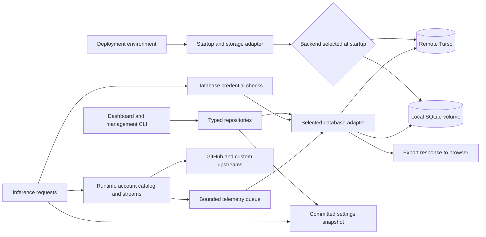

# SQLite and Optional Turso Persistence Design

Status: approved by user on 2026-09-08; implementation started from upstream b3da081 (PR110/PR111).
Date: 2026-09-08.
Scope: one gateway process per self-hoster, with local SQLite by default or that deployment's optional remote Turso database.

## 1. Decisions already made

The user selected database-backed persistence, accepted Turso latency/Free-plan limits, permitted small runtime caches, retained configuration export, and deferred smarter account scheduling. The latest instruction makes Turso optional: use local volume-mounted SQLite when both Turso variables are absent, and remote Turso when both are present. This supersedes the earlier remote-only requirement. In either mode, no JSON state files, diagnostic files or disk spool is allowed. Local mode permits only the selected SQLite database and its SQLite-managed journal/WAL/SHM files as application persistence. Remote mode creates no local application persistence directory or database. Repository manifests, source fixtures, build artifacts, operator-supplied certificates and user-downloaded exports are outside this restriction.

TURSO_DATABASE_URL and TURSO_AUTH_TOKEN are optional as a pair. Trim whitespace: neither configured selects local SQLite; both configured select Turso; exactly one configured is a startup configuration error. The endpoint includes the database identity. Invalid credentials, network errors or a later Turso outage never trigger a switch to local SQLite. Backend selection is fixed for a process lifetime. This draft follows the user's preference for those two database variables: recoverable upstream credentials are sensitive database values, not application-encrypted. Holders of local database files or remote database read access can retrieve them. Passwords remain Argon2id hashes; gateway-verified bearer secrets remain SHA-256 digests. Do not derive an encryption key from the database token or place it alongside ciphertext. A separate encryption key remains an optional review choice, not required in this draft.

Retain environment/CLI settings required to launch/connect the process: bind host/port, outbound proxy/TLS/certificates, trusted proxy/public origin/CORS/voice origin, integration ID, Direct Connect switch, logging switches, Sentry instrumentation and optional DATA_DIR for local mode. DATA_DIR defaults to ~/.local/share/copilot-api outside Docker; Docker uses /app/data with a named volume. The database filename is copilot-api.sqlite. Turso mode ignores DATA_DIR for persistence and never opens the local database. Retain optional 1Password/Varlock delivery for optional Turso/deployment variables. GitHub/provider/Groq/gateway/admin credential variables and provider apiKeyEnv are migration inputs only after cutover, never competing runtime authorities.

## 2. Objective and non-goals

Centralize durable configuration and identity in typed repositories, enable browser account management and administrator password changes, preserve client protocol compatibility and retain usage/activity across restarts. Local SQLite supplies a zero-cloud-setup default; optional Turso makes persistence independent of the gateway host. Both modes have the same application features, schema and logical backup format.

Do not implement weighted scheduling, quota-aware selection, distributed gateway coordination, conversation recovery, durable bridge work execution, or arbitrary file upload storage. Keep current rendezvous selection, first-eligible default, failover restrictions, model fallback behavior, and explicit account/provider pins. This is a storage and management change, not a protocol cleanup.

## 3. Architecture

All SQL stays in src/lib/storage. Route handlers and inference translators consume existing domain APIs backed by repositories. A small Storage interface has two concrete adapters: Bun's built-in bun:sqlite locally and the pinned Turso SDK remotely. No generic plugin framework, ORM or embedded sync replica is introduced. Repositories/migrations use the common supported SQLite SQL subset; no Turso-only runtime feature is required by application logic. Structured JSON values inside database columns remain acceptable; the restriction is on standalone JSON files, not the representation.

Startup resolves the backend, validates local directory access or remote credentials/engine, applies the same versioned migrations, loads validated configuration and creates the account runtime registry. It can serve the authenticated dashboard with zero or unhealthy GitHub accounts. A genuinely new local database is initialized intentionally; unavailable/corrupt existing data never becomes empty fallback settings. Initial storage failure exits with a sanitized diagnostic before protected traffic. Existing liveness shape remains; a minimal readiness endpoint returns 503 for unavailable storage without revealing schema, path or credentials.

Once started, database outage rejects new protected requests and management mutations with a typed storage_unavailable 503 (or equivalent pre-upgrade/stream error). Every new inference turn on an existing WebSocket also checks database authorization and configuration revision; after upgrade use that protocol's error envelope instead of another HTTP response. Do not authenticate using stale cached authorization decisions. Already admitted, in-flight streams continue with their request-local snapshot. Do not count a storage failure as invalid credentials or add an IP-ban strike.

## 4. Adapters and transaction contract

Local SQLite uses bun:sqlite with foreign_keys=ON, journal_mode=WAL, synchronous=FULL and a bounded busy_timeout (5 seconds). Resolve/create only selected DATA_DIR with restrictive POSIX permissions or appropriate Windows ACLs; no recursive permission edits. Mount the entire directory on supported same-host storage, not NFS/SMB. Permit copilot-api.sqlite and SQLite-managed sidecars only. Read-only/corrupt existing database is a storage error. One mutex covers ALL shared-connection reads/writes; transaction-scoped helpers bypass reacquisition and cannot escape their callback. Bun 1.4.0 accepts an async transaction(callback) but commits at Promise return, so NEVER use it for async work: own explicit BEGIN/await/COMMIT with rollback on rejection. Other CLI processes use SQLite locking and revision checks. Never hold a write transaction across upstream network/password hashing. Long backups use isolated read snapshots; document WAL growth and bound transfer duration.

Pin @tursodatabase/serverless to 1.4.0. The published package was fetched through https://packagefeedproxy.microsoft.io/npm/ and loaded in Bun 1.4.0 without installing it; no remote query was run. It supports the selected turso:// URL form, parameter binding, query timeouts, and atomic batches with an explicit mode.

Before implementation relies on the supplied database, run SELECT-only engine/version probes. The newer Turso Cloud engine is currently documented as early preview; remote libSQL uses a different SDK. Do not silently substitute a driver if the endpoint is a different engine.

Shared adapter rules (Turso-specific API details apply only to the remote adapter):

- Parameterized internal SQL only; normalize unknown SDK results into strict domain types.
- Turso call timeout 10 seconds; bounded total write operation deadline 30 seconds. Local SQLite uses bounded busy_timeout and serialized access; do not pretend synchronous SQL can be canceled with a Promise race. Do not change inference upstream timeouts.
- A write operation exclusively owns its connection. Enable and verify foreign-key enforcement before BEGIN.
- Use batch(statements, "immediate") for fixed atomic mutations; plain batch is not atomic. Never include transaction-control SQL in batch statements.
- Read-dependent operations use adapter-owned BEGIN IMMEDIATE, reads/writes, COMMIT and rollback on the same exclusive connection. Do not share a transaction connection with other requests. Avoid the deprecated transaction() API.
- The published transactionAsync helper starts a fresh session, so it does not inherit foreign-key setup. Do not assume parent connection PRAGMAs carry over.
- Track DDL migrations with capi_schema_migrations, not writable PRAGMA user_version. Record checksums and reject a newer/incompatible schema or changed applied checksum.
- Retry only explicitly recognized, definitely rolled-back contention failures, at most twice. A timeout/disconnect can follow a successful commit: do not blindly repeat writes.
- Durable mutations have a stable operation ID bound to operation kind, actor and input digest. Commit a nonsecret operation marker/result in the same transaction. Never persist newly issued raw gateway/session/OAuth/setup credentials in that result. Reconcile uncertain commits by ID before publishing; plaintext issuance values remain request-local. If the value is lost after commit, reconcile metadata and explicitly issue/revoke a replacement instead of retrieving plaintext from a marker.
- Test DDL rollback, foreign-key enforcement, uniqueness, concurrent writes, same/fresh-connection read-after-write, and reconnect persistence against the actual remote engine. Local fake tests cannot prove these contracts.

Remote engine probes/test tables and local adapter implementation run only after plan approval. Use one shared contract suite against local file-backed SQLite and remote Turso, including reopen, rollback, foreign keys and read-after-write. Credentials never enter source, docs, shell output, fixtures or browser responses.

## 5. Data model and authority

Use capi_ prefixed, versioned relational tables. INTEGER account IDs are immutable and never reused; migration preserves existing zero-based positional IDs. New IDs start above the highest historical account ID, including tombstones.

| Table/group | Contents |
| --- | --- |
| capi_schema_migrations, capi_metadata | Migration version/checksum, store ID, monotonically increasing config revision, history clear generations |
| capi_settings | Validated application configuration documents by namespace; prompt/model defaults, replacements, redirects, settings, routing/fallbacks, feature flags and Statsig values |
| capi_accounts | Stable account ID, normalized GitHub domain, immutable upstream user ID, display login/label, enabled/removal state, credential revision, sanitized validation metadata |
| capi_account_credentials | Recoverable GitHub OAuth value; separated from public account metadata |
| capi_providers, capi_provider_secrets | Provider metadata/models/aliases and recoverable API key plus custom headers, isolated from list/export DTOs |
| capi_gateway_credentials | Named gateway credential digests and revocation metadata; plaintext returned only at explicit creation/import input |
| capi_inference_credentials | Existing managed trusted-JWT and inference-only digests, labels, enabled state and timestamps |
| capi_ip_allowlist | Existing persistent allowlist entries and timestamps |
| capi_admin, capi_admin_sessions, capi_setup_codes | Singleton Argon2id verifier/version, existing hashed session/CSRF records and expiries, expiring one-use setup-code digests |
| capi_device_login_intents | Administrator-owned expiring GitHub device authorization state; canceled/expired intents cannot complete account creation |
| capi_oauth_codes, capi_oauth_families, capi_oauth_access, capi_oauth_refresh | Existing code/PKCE, principal/scope/family, digest, revocation and refresh semantics |
| capi_usage_minutes, capi_usage_lifetime | Existing complete minute/model aggregates and lifetime totals; no automatic shortening of existing usage retention |
| capi_routing_minutes | Existing routing aggregates/dimensions, retained 24 hours |
| capi_activity | Sanitized handler and operator activity records; 7 days, at most 50,000 rows and 64 MiB of payload |
| capi_debug | Sanitized bounded diagnostic captures; existing 10-minute complete / 60-minute other expiry, max 2,000 rows and 128 MiB |
| capi_applied_operations, capi_imports | Mutation reconciliation/idempotency and explicitly completed import manifests |
| capi_process_runs, capi_collection_gaps | Clean/unclean run markers, last confirmed flush and known/unknown collection gaps |

Use primary/unique/foreign-key constraints for stable references; use nullable timestamp tombstones rather than renumbering identities. Account tombstones are retained while referenced by policy/history; account secret material is removed after request drain. Do not retain raw database/GitHub/provider tokens in activity, debug, snapshots returned to UI, or ordinary export.

Authentication and admin/session/OAuth reads are indexed database queries. Configuration getters may remain synchronous over one initialized immutable snapshot. Each request captures one configuration revision; mutations validate, commit, then publish a replacement snapshot. The live process checks the revision before each protected request/new WebSocket turn and reloads only when changed; this also observes explicit management CLI changes without a separate cache-invalidation service. Independent parallel requests already admitted may finish on their original snapshot. Keep per-namespace content revisions as well as the global revision: only changed fallback policy advances its fallback revision. Unrelated settings, provider or account edits must not clear conversation fallback or ForeignThinkingState.

## 6. Memory and history boundary

Keep only current configuration snapshots, account credentials/catalog/eligibility needed for active service, request-local state and bounded caches/queues in memory. Keep current tokenizer and attachment-dedup caches.

Responses WebSocket snapshots, active turns, sockets, cancellation, request retry state, fallback conversation affinity/ForeignThinkingState, clear epochs, MCP sessions, IP failure history/leases, bridge environment/work/session/capability/event execution state remain volatile runtime state. This migration does not pretend those are resumable after restart. Historical operator/bridge lifecycle summaries may be recorded as activity, but a stored summary is not an executable queue or live capability.

Usage/history writes are separate from critical configuration/security writes. History uses a bounded in-memory queue: flush at one second or 100 records, 2,000 pending records / 16 MiB limit, maximum pending age five minutes. Coalesce usage/routing deltas and prioritize them over diagnostics. Stable batch IDs and same-transaction deduplication prevent double counting after retry. Remove queued items only after confirmed commit. The operation-ID retention must exceed maximum retry/queue age, including delayed requests. Do not compact existing usage to a shorter reporting window.

If the queue fills, discard diagnostic bodies first, then oldest diagnostics; if counters cannot be retained, record explicit dropped/lost counts. Expose queue depth, drops, last successful flush and degraded state in authenticated storage status. Persist known collection-gap counts once storage recovers. A durable process-run marker starts unclean and is marked clean only after confirmed shutdown flush; a later startup labels a prior unclean run as an unknown collection gap, never a guessed request count. No disk spool or recursive database logging of database failures. A crash may lose uncommitted telemetry; all imported/committed buckets remain retained. Stop new admission and attempt a five-second flush on shutdown; report any remaining loss to stderr. Do not claim guaranteed delivery or exact complete collection across crashes.

Handler logs go to stdout/stderr and the selected database history pipeline, never logs/*.log. Local mode writes history into SQLite; remote mode writes to Turso. Console redirection performed by an operator/container runtime is outside the application persistence contract.

## 7. Debug/replay data

Current debug capture retains raw authorization headers in memory. Do not copy it verbatim into either durable backend.

Scrub auth/cookie/API-key/session headers, userinfo and sensitive query values, credential fields in structured bodies, known active credential literals, and errors before queue insertion. Preserve normal conversation payload for a bounded diagnostic/replay record only when it remains safe and complete. Remote diagnostics are administrator-only. They can contain conversation content; TTL/caps are enforced on reads and cleanup.

Limit diagnostic request/response capture to 1 MiB per direction. This is not a request-size limit: upstream forwarding, responses and bridge events remain unbounded as currently supported. Capture must tee streams without delaying or consuming the client stream. On overflow, store byte-count/truncation metadata, omit incomplete body content, and mark capture non-replayable. Malformed or unsupported sensitive-body formats may retain metadata only. If redaction changes a replay payload, mark it non-replayable until the operator supplies a deliberate replacement body.

Replay always obtains current credentials and current authorization through existing routing; never replay retained authorization headers. Clear-history commits a new generation before deletion so delayed completion/queue writes cannot resurrect cleared records. Crash-surviving unfinished metadata is interrupted/outcome unknown, never invented success/failure.

## 8. Startup, account management, providers and credentials

Unify zero, one and many accounts under the existing TokenPool/registry; remove single-account global credential authority. This does not authorize changing single-account request behavior to the current multi-account branch. Preserve one-account unknown/disabled-model handling, endpoint authority, session-token binding, HTTP 421 recovery and authentication rejection, retaining a compatibility branch if needed. Background account validation may leave a stored account unhealthy and repairable through the dashboard. Do not block dashboard access on an upstream outage.

Create an Accounts screen using existing Astryx/React components. Support list, add OAuth value, device-code sign-in, label, enable/disable, reconnect same identity, revalidate, remove. Domain support remains github.com and supported Enterprise Cloud *.ghe.com. Device-code flow reuses existing polling/expiry/slow-down contracts; authorization intents are stored durably with TTL and encrypted nowhere under the two-variable design, so exclude them from exports/logs. Cancellation/expiry prevents late token completion from saving an account. The server-loopback browser OAuth helper is not a remote dashboard callback implementation.

Credential replacement verifies immutable upstream user ID and normalized domain before updating the original record. A different identity becomes a new account. Failed validation or failed commit preserves existing credentials/catalog. New/updated catalog publication happens after commit.

Disable stops new selections and retains the stored secret so enable can work again. Remove stops new selections and marks the account deleting; in-flight calls finish using a request-local credential snapshot. Only removal deletes the stored secret after in-flight requests drain. On a subsequent process start there are no surviving requests, so finish pending deletions. Explicit unavailable account/provider pins reject rather than switching identities.

Ordinary session-key rendezvous selection is recalculated over current eligible accounts. Membership/eligibility changes can remap the next turn of an idle conversation. Immutable IDs do not remove that limitation. The account-management UI explains it; do not claim complete conversation continuity or add a hidden binding algorithm in this migration.

Custom provider CRUD preserves models/aliases, request headers, input/output behavior, streaming and embedding contracts. Replace runtime apiKeyEnv with stored secret input; omitted/blank secret edit fields mean retain, explicit clear is separate. Gateway credential management creates named random values shown once, stores only digests, lists metadata, and revokes explicitly. Do not revoke the last gateway credential through normal UI because existing dashboard login requires a gateway credential plus password. Migration/owner recovery can establish a replacement atomically.

Groq credentials move to the same database secrets boundary, both transcription paths use it, and dashboard status derives from database configuration.

## 9. Admin setup, password and OAuth compatibility

No permanent bootstrap environment variable is needed. Explicit CLI admin --setup-code, against an unconfigured store, creates a 32-byte random code, stores its SHA-256 digest with 15-minute expiry, and prints it once through the requested command output. Reissuing invalidates previous unused codes. Server startup never prints tokens automatically.

Browser setup submits setup code, initial gateway key and admin password with an allowed exact Origin. First setup cannot require a preexisting administrator session/CSRF token; the one-use setup code plus Origin check protect this boundary, and success creates the initial session/CSRF material. Atomically consume the code and create singleton admin verifier plus gateway digest. Concurrent/reused/expired setup fails. Initial gateway key input is held only for this request and never written as plaintext. Later login retains gateway-key-plus-password behavior.

Keep existing Argon2id parameters, cookie flags, CSRF/origin rules and 30-day sliding administrator sessions. Password change requires current password and valid administrator session, then replaces the hash, increments version, revokes old sessions and issues the replacement session atomically.

Owner recovery is explicit CLI admin --reset: prompt for a new password, update the database, increment admin version and revoke administrator sessions. Preserve independent gateway/inference/OAuth credentials. It does not delete the admin row and reopen public setup. No email recovery or permanent recovery-code system in v1.

Preserve OAuth code TTL, PKCE binding, one-use code exchange, scopes, family/principal binding and explicit revocation. Preserve the current deliberately reusable refresh token and long client-advertised lifetime; do not introduce refresh-reuse revocation, forced routine expiry, or loss of existing client tokens. Database outage is not invalid_grant.

## 10. Import, export, backup and cutover

Normal export stays ZIP/JSON, generated from a consistent database read snapshot directly into the HTTP response. Preserve current nine filename entries and secret redaction, plus a versioned manifest and sanitized account/provider metadata. No token/session/auth store content in ordinary export. Do not offer a sanitized export as a credential-complete backup.

Provide explicit password-encrypted full backup/download and restore. Backup payload contains schema/format version, store ID, checksummed logical records, settings/accounts/providers/credentials, OAuth and usage/history records; excludes Turso URL/token, setup intents, active runtime objects and transient execution state. Use one streaming AES-256-GCM envelope with a scrypt-derived key, fresh 16-byte salt and 12-byte IV, fixed versioned KDF parameters, authenticated header, ciphertext and final 16-byte authentication tag. Stream logical NDJSON records inside the ciphertext; an authenticated terminal manifest records counts and SHA-256 of preceding record bytes. No independently encrypted frames or custom per-frame nonce scheme. Password is per-operation and never persisted. Restore writes only to an explicitly empty replacement database with an incomplete-restore marker that blocks serving; verify the tag, terminal manifest, counts and references before atomically clearing the marker. Malformed/canceled/failed restore never becomes ready and is cleaned/retried only for its exact restore ID. No local temporary files. Bound each decoded record to 8 MiB, fixed KDF parameters and known table kinds; reject reordered/duplicate records, unknown versions or truncated input. Transfer operations use a separate 30-minute cancelable deadline with 10-second database call timeouts, not a 30-second total mutation deadline. The original database supplies rollback.

Separate one-time CLI storage import-legacy --from <explicit-directory> [--from-env] reads existing JSON/token files and selected credential env variables. These are read-only migration inputs, never normal startup fallback and never rewritten or deleted. Preserve source files for operator rollback. Use existing parsers/validation, resolve provider apiKeyEnv once, retain positional account IDs/routing mapping, import all historical usage totals/buckets, and retain OAuth credential families/digests. Admin environment markers require the actual Argon2id hash, not merely a fingerprint; fail with a repair instruction if missing. Revoke imported admin sessions when changing credential authority.

Import is preview then explicit apply using a stable manifest digest and expected target revision. Permit legacy import only into an unconfigured target; same committed manifest is idempotent, a different nonempty target is rejected. Resolve all references and errors before promotion. No upstream verification requests or password hashing are held inside database write transactions.

Full restore targets an empty replacement database through an owner CLI command: a new Turso database or a new local DATA_DIR/database file. The current database remains intact for rollback. The logical format supports local-to-Turso and Turso-to-local transfer; setting/unsetting environment variables alone never migrates data. Preserve gateway/inference/OAuth credentials and stable IDs; invalidate admin sessions/setup intents. Run admin --reset if needed. Verify counts/checksums/request paths before switching backend configuration and restarting. A dashboard download does not switch the running database or deploy anything.

Cutover changes credential sources/config format: document as a breaking release. Update .env.schema/generated env.d.ts, CLI help, Docker/Compose/entrypoint, README and CI. Clearly label both Turso variables optional, specify the both/neither/partial truth table and show local and remote examples. Retain DATA_DIR and a named app data volume for default local SQLite, with no external pre-created-volume requirement for new users. Provide a remote Compose example without a data mount. Never replace/delete the existing user's volume during this task; document how existing volumes are attached/imported explicitly. Legacy credential variables never override database values. Existing 1Password can supply the optional pair. Do not delete old JSON sources automatically.

## 11. Implementation stages and agent boundaries

One architecture spec, four ordered implementation plans:

1. Foundation and configuration: backend selection, local SQLite and pinned remote adapters, shared schema, operation reconciliation, snapshot repositories, cold-start/CLI wiring.
2. Identity and dashboard: authentication/OAuth, account/provider/gateway lifecycle, browser setup/password controls.
3. History and runtime disk removal: durable usage/routing/activity/debug, sanitized bounded queue, export-compatible async reads, shutdown.
4. Transfer and cutover: legacy migration, config export, encrypted backup/restore, Docker/CLI/docs, end-to-end verification.

Foundation APIs and migrations land first. Thereafter independent repositories/UI/history work can use subagents with disjoint file ownership. A coordinator owns shared startup, dashboard registration and schema integration; workers do not simultaneously edit those files. Use subagent-driven development after approval, with task review and whole-change review. Preserve the currently changing model-fallback work and rebase the execution plan onto its agreed committed baseline or an exact isolated snapshot.

## 12. Acceptance map

| ID | Acceptance | Plan |
| --- | --- | --- |
| R01 | Local SQLite by default or Turso when both optional variables set; no JSON/log/spool files; remote mode no local DB writes | 1,3,4 |
| R02 | Both adapters pass shared transaction/schema contracts; exact remote SDK/engine verified, typed errors and bounded waits | 1 |
| R03 | Every prior JSON store migrated; validation/default/ordering semantics retained | 1,2 |
| R04 | Critical changes atomic, operation IDs reconcile uncertain commits, snapshots publish after commit | 1,2 |
| R05 | Indexed database authorization, 503 on storage outage, no auth strike/open access fallback | 2,4 |
| R06 | Zero-account dashboard, one registry, immutable IDs, identity-safe credential replacement/drain | 2 |
| R07 | Accounts/providers/Groq/gateway credentials manageable without upstream secret env variables | 2 |
| R08 | One-use setup code, password change and owner reset; admin session/CSRF continuity | 2 |
| R09 | OAuth code/refresh/revocation/principal/scope and long-lived token contracts survive restart | 2,4 |
| R10 | Same routing/affinity/fallback/ForeignThinkingState and protocol semantics; limitation disclosed | 2,3,4 |
| R11 | All imported/committed usage retained; idempotent new telemetry, explicit collection gaps and routing/history retention | 3 |
| R12 | No credentials in either backend's logs/debug/export; diagnostic limits never limit requests | 3,4 |
| R13 | Bounded memory-only history queue, visible loss/degradation, clear-generation and shutdown races | 3 |
| R14 | Diskless consistent sanitized export and encrypted backup/restore with known versions | 4 |
| R15 | Explicit read-only legacy import, stable references, env-admin handling, source preservation | 4 |
| R16 | Remote read-only filesystem proof; local writes limited to mounted SQLite files; all HTTP/WS next-turn regressions on both backends | 4 |
| R17 | Turso pair optional in README/docs/schema/Compose; local named-volume default; partial config and runtime failure never switch backend | 1,4 |
| R18 | Source/client manifests and operator downloads remain allowed; no secret in committed artifacts | all |

## 13. Evidence and remaining implementation verification

Execution reconciliation: PR111 fallback chains, alias identity checks, three-hop bound, cacheEpoch/requestSequence and ForeignThinkingState remain unchanged. Separate captured request fallback revision from LIVE committed namespace revision used to reject stale accepted-result cache publication. PR110 copilotAccountSubject comes from analytics_tracking_id and must travel with leases/catalog refresh; it is not the immutable GitHub user ID. Preserve model-session acquisition body hints, token-only refresh, replay provider/account provenance and WebSocket continuation identity. Execution base is b3da081321d59563e644bc5ba1dc214d924eaefc on codex/database-persistence in the isolated copilot-api-database worktree; dirty original checkout was preserved when pull refused overwrites.

Current repo evidence: src/lib/paths.ts; src/lib/config.ts; src/start.ts; src/lib/accounts-store.ts; src/lib/token-pool.ts; src/lib/admin-auth.ts; src/lib/oauth-store.ts; src/lib/config-export.ts; src/lib/logger.ts; src/lib/usage-tracker.ts; src/lib/routing-telemetry.ts; src/lib/llm-debug-log.ts; src/routes/code-sessions/session-store.ts; Dockerfile; docker-compose.yml; .env.schema. Working tree contains unrelated ongoing fallback work; exact line numbers will drift.

Primary sources checked on 2026-09-08:

- https://bun.com/docs/runtime/sqlite
- https://sqlite.org/pragma.html
- https://sqlite.org/wal.html
- https://docs.turso.tech/sdk/ts/reference
- https://packagefeedproxy.microsoft.io/npm/@tursodatabase/serverless/-/serverless-1.4.0.tgz
- https://docs.turso.tech/turso-cloud (new engine early-preview status)
- https://docs.turso.tech/cloud/limitations
- https://docs.turso.tech/sql-reference/statements/create-table
- https://docs.turso.tech/sql-reference/statements/transactions
- https://docs.turso.tech/cloud/durability
- https://turso.tech/pricing
- https://docs.turso.tech/features/point-in-time-recovery

The supplied endpoint/key has not been queried or persisted. Actual engine/version, permissions, schema emptiness, SQL atomicity and restore behavior remain explicit execution preflight checks. Do not describe those as already verified.
